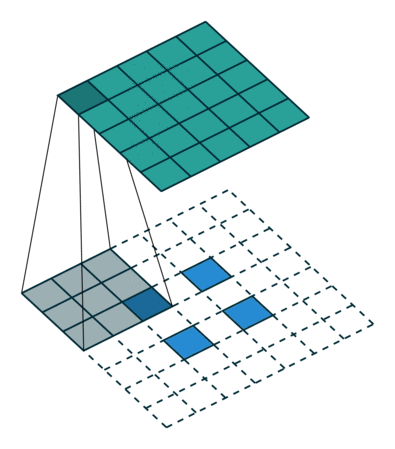
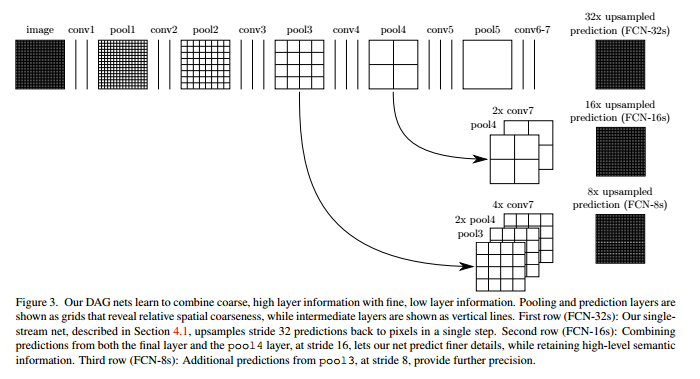
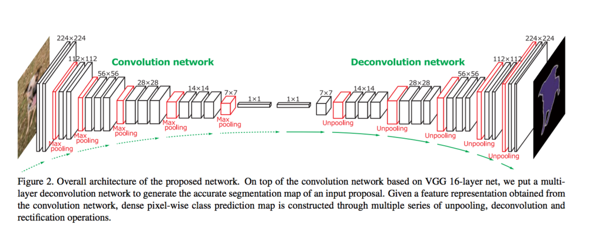

FCNs for Semantic Segmentation
========================================================
author: Karma Tarap & Alexander Noll
date: 26-10-2017
autosize: true

Image Classification
========================================================

Standard convolutional neural networks (CNNs) are good at **global classification**:

Image Segmentation
========================================================

What if we are interested in asking the question: where is the hotdog?

Image Segmentation Examples
========================================================

Problem
========================================================

So we have a *local* classification problem:

+ For each point of an image a class is supposed to be predicted
+ Numerous applications: e.g
  - Machine vision
  - Medical imaging
  - Object detection
  - Self-driving-cars (**Code Demo**) 

Convolutional layer
========================================================

**Filter**
***

Convolutional layers
========================================================

Convolutional layers use the **spatial symmetry** of the problem to reduce the number of weights. They do this using the concept of **weight sharing**: a hot-dog in the upper right is the same as a hot-dog in the lower left corner.

Important parameters:

+ Kernel size: how big of a region should share the same weights
+ Stride: how many steps at a time should the filter take

Pooling layers
========================================================

Summarize patch of an image by taking the maximum or mean (or whatever)

Important parameters:

+ Kernel size: how big of a region should the summary function be applied to
+ Stride: how many steps at a time should the filter take

Pooling layers
========================================================

Key Points
========================================================
+ **End to end** convolutional networks for semantic segmentation
+ Upsample using deconvolutional layers
+ Transfer learning for pretrained networks
+ Skip layers to improve upsampling prediction

End to end convolutional networks
========================================================
+ Series of convolutional layers and pooling-layers decreasing the size of the output
+ Followed by a series of **deconvolutional layers** or **transposed convolutional layers** or **upsampling layers** that increase the output size

Convolutional (CNN) Vs Fully Convolutional NN (FCN)
========================================================
Architecture of VGG16

***
Architecture of FCN32

Upsampling
========================================================

How do we retrieve the size of the original image?

Use **upsamling** or **transposed convolutional** or **deconvolutional** layers to upscale image

Upsampling -  No pad, no strides
========================================================

***

Upsampling -  No pad, 2 strides
========================================================

***

Transfer Learning
========================================================

+ Use architecture from pre-trained CNNs
+ Use weights from networks trainined on imagenet
+ Replace connected layers with upsampling

*Transfer learning with direct up-sampling produced state of the art performance*
Skip layer
========================================================

Used to transfer information (spatial) from **early layers** directely into layers close to the output layer via elementwise addition.

Skip connections - Results
========================================================

Recap:
========================================================

***
+ End-to-end convolutional network
+ Transfer Learning
+ Upscaling
+ Skip layers

FCN-8 Results: PASCAL VOC
========================================================

+ 1112 images (see below)
+ 20% improvement: 

Reference:
========================================================
Fully Convolutional Networks for Semantic Segmentation

Jonathan Long, Evan Shelhamer, Trevor Darrell
https://arxiv.org/abs/1411.4038

========================================================

Demo

